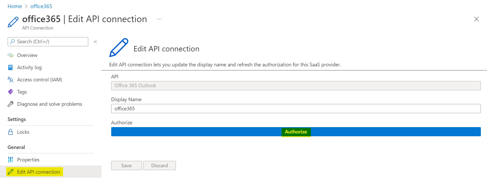
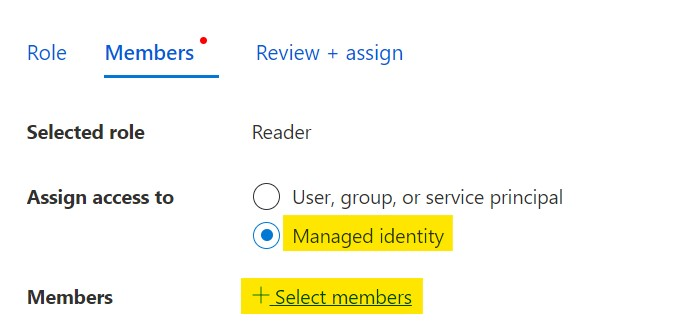
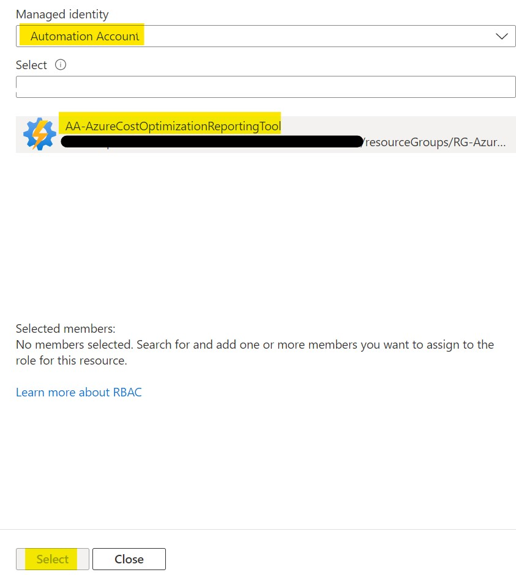

# Azure Cost Optimization Reporting Tool
The Azure Cost Optimization Reporting Tool (ACORT) is a free, open-source tool designed to improve the cost efficiency of your Azure deployments. It performs a multi-subscription assessment of your Azure resources against Microsoft's cost optimization best practices defined in the [Well-Architected Framework](https://docs.microsoft.com/en-us/azure/architecture/framework/cost/) and [Cloud Adoption Framework](https://docs.microsoft.com/en-us/azure/cloud-adoption-framework/get-started/manage-costs). A recurring email report is generated containing optimizations for each subscription with associated cost data pulled from the previous month.

* Assess your Azure workloads against 25 Microsoft cost optimization best practices scoped to subscriptions, management groups, or the entire tenant.
* Get an efficiency score for each subscription and total cost optimization potential ($).
* Receive a recurring (weekly or monthly) email report.
* Leverage cost data to understand optimization potential and determine remediation priority.
* Incorporates all Azure Advisor recommendations.

## Prerequisites
* A user account with the following role(s) on a subscription:
  * `Contributor` and `User Access Administrator`
  * OR `Owner`
* A user with a mailbox to send the email report.

## Deployment
1. Open Azure Cloud Shell (PowerShell)
   - [Configure Cloud Shell if not done already)](https://docs.microsoft.com/en-us/azure/cloud-shell/quickstart-powershell)
2. Run `git clone https://github.com/MarcSteene/AzureCostOptimizationReportingTool.git azurecostoptimizationreportingtool`
3. Run `cd ./azurecostoptimizationreportingtool/`
4. Run `code config.txt`
5. Update the configuration as required:
   - `Subscription Name`: The subscription to deploy the tool's resources to.
   - `Resource Group Name`: The name of the Resource Group to deploy the tool's resources to.
   - `Logic App Name`: The name of the Logic App used to send the email report.
   - `Automation Account Name`: The name of the Automation Account used by the tool.
   - `Deployment Location`: The display name of the location to deploy the tool's resources to.
   - `Report Frequency`: The report distribution frequency. Supports Weekly or Monthly.
   - `Mail Recipients`: The individuals to receive the reports. Use ; as the delimiter between recipients.
6. Save (Control+S) and close (Control+Q) the editor.
7. Run `./Deploy-AzureCostOptimizationReportingTool.ps1` and wait for deployment to complete.
   - If any errors occur during deployment the script will terminate. Resolve the error and run the script again. It may be necessary to delete the Resource Group and any resources created.
9. Navigate to the created Resource Group and select the `office365` API connection resource.
10. In the list menu, select `Edit API Connection` and then select the `Authorize` button.

12. Authenticate as the user whose mailbox you wish to use to distribute the reports and then select `Save`.
13. Assign the `Reader` role to the Automation Account's Managed Identity on any management groups and subscriptions you wish to be assessed. To assess all subscriptions in the tenant, assign the `Reader` role to the Tenant Root Management Group.

15. Once the `Reader` role has been assigned to the desired assessment scopes, navigate to the `ACORT-Main` runbook and select `Start`.

17. This will trigger a manual report generation. After a few minutes the configured receipients should receive the report attachment via email. For large environments with many subscriptions this could take up to an hour.
18. If the email report is not received, refer to the troubleshooting steps below.

## Troubleshooting
1. Navigate to the deployed Automation Account.
2. Select `Jobs` from the list.
3. Select the `ACORT-Main` job from the list.
4. Select `All logs` and review the output. Resolve any errors.
5. If all looks well in the main job output, return to the Jobs list.
6. Review all `ACORT-ProcessSubscriptions` job logs (there may be multiple worker jobs if you have multiple subscriptions) and resolve any errors.

## Disclaimer
The Azure Cost Optimization Reporting Tool is not supported under any Microsoft standard support program or service. It is provided AS IS without warranty of any kind. The entire risk arising out of the use or performance of the script and documentation remains with you.
